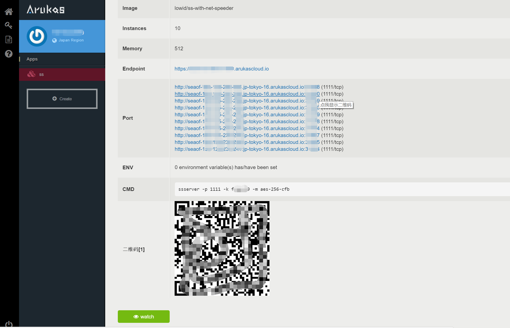

# qrcode-for-arukas-shadowsocks
an [Tampermonkey](http://tampermonkey.net/) script  

generate qrcode for [arukas.io](https://app.arukas.io) shadowsocks

使用arukas.io部署的shadowsocks，由于IP及端口经常变动，同时IP地址在URL里面，不太容易调整，所以编写该脚本自动生成二维码。

由于页面的内容是动态生成的，所以设置了5秒后才运行脚本，如果无效，刷新页面等待。

